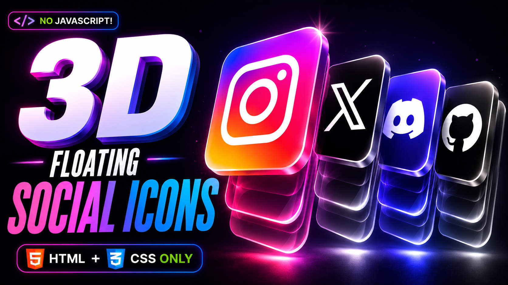

# 🚀 3D Floating Social Icons

A premium **3D Floating Social Icons UI** built using only **HTML5 & CSS3**. This project features realistic 3D depth, layered glassmorphism, smooth magnetic hover animations, dynamic shadows, and beautiful brand-colored neon glow effects—without using any JavaScript.



## ✨ Features

- 🎨 Premium Modern UI Design
- 🧊 Realistic 3D Perspective
- 🌟 Glassmorphism Layers
- ⚡ Smooth Magnetic Hover Animation
- 💫 Dynamic Shadow Effects
- 🔥 Brand Color Neon Glow
- 📱 Responsive Layout
- 🚀 No JavaScript Required
- 🎯 Clean & Well-Commented Code

## 🛠 Technologies Used

- HTML5
- CSS3
- CSS Perspective
- CSS 3D Transforms
- CSS Transitions
- Glassmorphism
- Font Awesome Icons

## 📂 Project Structure

```
3D-Floating-Social-Icons/
│── index.html
│── style.css
│── preview.png
└── README.md
```

## 🎨 Included Social Icons

- Instagram
- X (Twitter)
- Discord
- GitHub

## 🚀 Getting Started

1. Clone this repository

```bash
git clone https://github.com/TineshChasiya/3D-Floating-Social-Icons.git
```

2. Open the project folder

```bash
cd 3D-Floating-Social-Icons
```

3. Run the project

Simply open **index.html** in your browser or use **Live Server** in Visual Studio Code.


## 🎥 YouTube Tutorial

Watch the complete step-by-step tutorial on YouTube.

## ⭐ Support

If you found this project helpful:

⭐ Star this repository

🍴 Fork it

📢 Share it with others

## 👨‍💻 Author

**Tinesh Chasiya**

GitHub:
https://github.com/TineshChasiya

YouTube:
https://www.youtube.com/@DesignAndMedia-DM

---

### 🌟 Don't forget to leave a Star if you like this project!